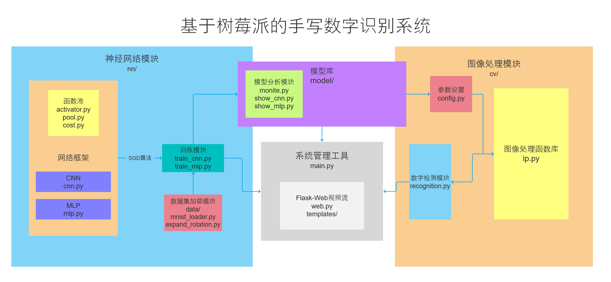
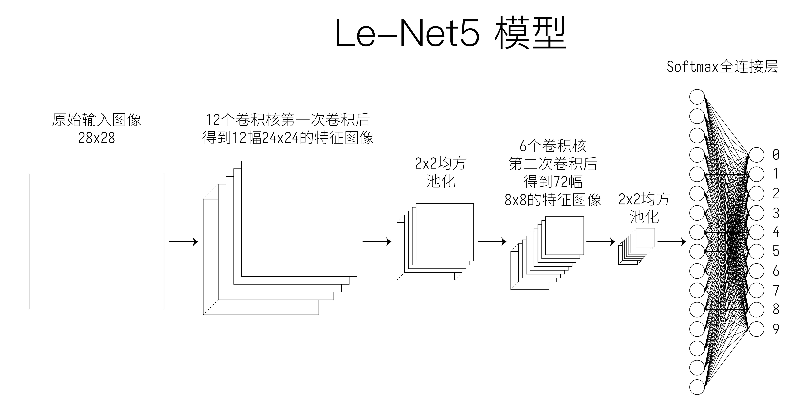

# 基于树梅派的手写数字识别系统

## 环境搭建

运行`setupCVEnv.sh`，按提示修改环境变量后将自动安装所需包、下载OpenCV源码并配置、编译、测试

CLI管理界面

```
$ python -m main
Neural Network Model Manager 1.4
Type "help" for more information.
$
```

## 系统架构

### 模块结构



### 网络结构

